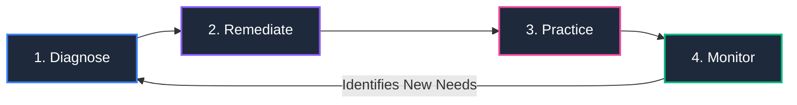

<div align="center">

# 🧮 MathSmart
### AI-Powered Interactive Learning System for Enhancing Mathematics Skills Among Elementary Learners

[](https://nextjs.org/)
[](https://react.dev/)
[](https://tailwindcss.com/)
[](https://ui.shadcn.com/)
[](https://fastapi.tiangolo.com/)
[](https://supabase.com/)
[](#-aral-pedagogical-framework)

<p align="center">
  <b>A research-backed, adaptive web application providing personalized diagnostics, targeted remediation, interactive practice, and Teacher/Administrator intervention analytics for Grade 6 learners.</b>
</p>

[Explore Documentation](./docs/SOURCE_OF_TRUTH.md) · [API Reference](./docs/API_ROUTES.md) · [System Diagrams](./docs/DIAGRAMS.md) · [Implementation Plan](./docs/IMPLEMENTATION_PLAN.md)

</div>

---

## 📖 Table of Contents

- [About The Project](#-about-the-project)
- [ARAL Pedagogical Framework](#-aral-pedagogical-framework)
- [Core Features](#-core-features)
- [Technology Stack](#-technology-stack)
- [System Architecture & Directory Structure](#-system-architecture--directory-structure)
- [Getting Started & Installation](#-getting-started--installation)
  - [Prerequisites](#prerequisites)
  - [1. Clone Repository](#1-clone-repository)
  - [2. Frontend Setup](#2-frontend-setup)
  - [3. Environment Variables](#3-environment-variables)
  - [4. Run the Dev Server](#4-run-the-dev-server)
  - [5. Python Backend Setup](#5-python-backend-setup-optional--in-development)
- [Working with shadcn/ui](#-working-with-shadcnui)
- [Project Documentation](#-project-documentation)
- [Git Workflow & Collaboration Guidelines](#-git-workflow--collaboration-guidelines)
- [Team & Organization](#-team--organization)

---

## 🎯 About The Project

**MathSmart** is an intelligent, web-based mathematics learning platform designed to address foundational mathematics gaps among Grade 6 learners.

Rather than a one-size-fits-all curriculum, MathSmart assesses individual student competencies, pinpoints conceptual misunderstandings using deterministic scoring plus Gemini-assisted explanations, and delivers targeted remediation modules and interactive practice exercises. The combined Teacher/Administrator role receives real-time mastery heatmaps and intervention suggestions to support in-class learning.

---

## 🔄 ARAL Pedagogical Framework

MathSmart follows the **DepEd ARAL (Assist, Remediate, Accelerate, Learn)** recovery model operating in a continuous 4-phase cycle:



1. **Diagnose**: Diagnostic tests assess competency baselines across Grade 6 Mathematics domains.
2. **Remediate**: The system maps learning gaps directly to ARAL modules (Assist, Remediate, Accelerate).
3. **Practice**: Students reinforce concepts through interactive math activities with instant feedback.
4. **Monitor**: Continuous evaluation updates mastery records and surfaces intervention alerts to teachers.

---

## ✨ Core Features

| # | Feature | Target User | Description |
|---|---|---|---|
| **1** | **Student Profiling** | Student / Teacher-Administrator | Records learner academic background, grade level, and competency baselines for individualized monitoring. |
| **2** | **Mathematics Diagnostic Assessment** | Students | Administers adaptive pre-tests, analyzes error patterns, and generates comprehensive student gap profiles. |
| **3** | **ARAL-Based Learning Modules** | Students | Targeted, bite-sized instructional modules categorized by ARAL tier (*Assist*, *Remediate*, *Accelerate*). |
| **4** | **Interactive Mathematics Activities** | Students | Interactive question types (multiple choice, numeric inputs, step-by-step math solver) with immediate hints. |
| **5** | **Progress Monitoring Dashboard** | Students | Visual tracking of completed modules, skill mastery levels, streak counts, and learning badges. |
| **6** | **Teacher/Administrator Intervention Dashboard** | Teacher-Administrator | School-wide and class-level competency heatmaps, at-risk student identification, and actionable remediation recommendations. |

---

## 🛠 Technology Stack

### Frontend Application
- **Framework:** [Next.js 16.3 (App Router)](https://nextjs.org/)
- **UI Library:** [React 19](https://react.dev/)
- **Styling:** [Tailwind CSS v4](https://tailwindcss.com/)
- **Design System:** [shadcn/ui (New York Style)](https://ui.shadcn.com/)
- **Icons:** [Lucide React](https://lucide.dev/)
- **State & Hooks:** Custom React Hooks (`useAuth`, `useStudent`, `useModules`, `useProgress`)

### Backend API & Math Engine
- **Framework:** [FastAPI (Python 3.11)](https://fastapi.tiangolo.com/)
- **Computation / AI Logic:** Deterministic Python services with NumPy/SymPy where appropriate; Gemini through a server-side adapter for advisory explanations and insights
- **Data Validation:** Pydantic v2

### Database, Auth & Media
- **Database:** [Supabase (PostgreSQL)](https://supabase.com/)
- **Authentication:** Supabase Auth with exactly two application roles: `student` and `teacher_admin`
- **Media Storage:** Cloudinary & Supabase Storage

---

## 📂 System Architecture & Directory Structure

```text
MathSmart/
├── .github/                      # CI/CD and pull-request templates
├── backend/                      # FastAPI backend
│   ├── app/                      # Startup, environment config, dependencies
│   ├── modules/                  # Business modules
│   │   ├── auth/
│   │   ├── students/
│   │   ├── assessments/
│   │   ├── competencies/
│   │   ├── learning_modules/
│   │   ├── activities/
│   │   ├── progress/
│   │   ├── interventions/
│   │   ├── teacher_admin/
│   │   ├── reports/
│   │   ├── settings/
│   │   └── shared/
│   ├── middleware/               # Cross-cutting HTTP concerns
│   └── requirements.txt
│
├── docs/                         # Project specifications
│
├── public/                       # Static assets
├── src/                          # Next.js frontend
│   ├── app/                      # Thin App Router composition
│   │   ├── (auth)/               # Login and registration
│   │   ├── (student)/student/    # Student URLs and layout
│   │   └── (teacher-admin)/teacher/ # Combined Teacher/Admin URLs and layout
│   │
│   ├── modules/                  # Independently owned vertical slices
│   │   ├── auth/
│   │   ├── student/
│   │   │   ├── dashboard/
│   │   │   ├── my-learning/
│   │   │   ├── activities/
│   │   │   ├── assessments/
│   │   │   ├── progress/
│   │   │   └── profile/
│   │   ├── teacher-admin/
│   │   │   ├── dashboard/
│   │   │   ├── students/
│   │   │   ├── interventions/
│   │   │   ├── assessments/
│   │   │   ├── competencies/
│   │   │   ├── learning-modules/
│   │   │   ├── activities/
│   │   │   ├── question-bank/
│   │   │   ├── grades-sections/
│   │   │   ├── reports-analytics/
│   │   │   └── settings/
│   │   └── shared/
│   │
│   ├── components/ui/            # shadcn/Radix primitives
│   ├── lib/                      # Infrastructure and framework helpers
│   ├── resources/
│   └── styles/
│
└── tests/
    ├── integration/
    └── e2e/
        ├── student/
        └── teacher-admin/
```

See [`src/modules/README.md`](./src/modules/README.md) and [`backend/README.md`](./backend/README.md) for module ownership and import-boundary rules. Feature-local `components`, `hooks`, `services`, `schemas`, `utils`, and tests are created only when needed.

---

## 🚀 Getting Started & Installation

Follow these steps to get a local development environment up and running.

### Prerequisites

Make sure you have the following installed on your machine:
- **Node.js**: `v20.x` or `v22.x` (Recommended: `v22.23.1`)
- **npm**: `v10.x` or higher
- **Git**
- **Python**: `v3.10+` *(required when working on backend services)*

---

### 1. Clone Repository

```bash
git clone https://github.com/MathSmart-Systems/MathSmart-AI-Powered-Interactice-Learning-System.git
cd "MathSmart-AI-Powered-Interactice-Learning-System"
```

---

### 2. Frontend Setup

Install the required npm packages:

```bash
npm install
```

---

### 3. Environment Variables

Create a `.env.local` file in the project root:

```bash
cp .env.example .env.local 2>/dev/null || touch .env.local
```

Add your local configuration (obtain active keys from team leads):

```env
# Supabase
NEXT_PUBLIC_SUPABASE_URL=your_supabase_project_url
NEXT_PUBLIC_SUPABASE_ANON_KEY=your_supabase_anon_key

# Backend API
NEXT_PUBLIC_API_BASE_URL=http://localhost:8000/api/v1
```

Gemini's API credential and selected model are existing server-side values in `.env`. Never expose either value through a `NEXT_PUBLIC_` variable, client bundle, documentation, or logs.

---

### 4. Run the Dev Server

Start the local development server:

```bash
npm run dev
```

Open [http://localhost:3000](http://localhost:3000) in your browser to see the application.

#### Available Scripts:
- `npm run dev` — Starts local Next.js dev server with Turbopack.
- `npm run build` — Compiles optimized production bundle.
- `npm run start` — Starts production build locally.
- `npm run lint` — Runs ESLint checks.

---

### 5. Python Backend Setup *(Optional / In Development)*

When developing backend API endpoints and math gap evaluation services:

```bash
cd backend

# Create virtual environment
python3 -m venv venv
source venv/bin/activate  # On Windows: venv\Scripts\activate

# Install dependencies
pip install -r requirements.txt

# Run FastAPI with live reload
uvicorn app.main:app --reload --port 8000
```

FastAPI interactive documentation will be available at [http://localhost:8000/docs](http://localhost:8000/docs).

---

## 🎨 Working with shadcn/ui

MathSmart uses **shadcn/ui** with the **New York style** and **Slate** color palette.

To add new UI components into `src/components/ui/`, use the shadcn CLI:

```bash
# Example: Adding dialog, tabs, dropdown menu, avatar
npx shadcn@latest add dialog tabs dropdown-menu avatar -y
```

Components will be automatically generated in [src/components/ui/](file:///src/components/ui/) and can be imported across the project:

```jsx
import { Button } from "@/components/ui/button";
import { Card, CardHeader, CardTitle } from "@/components/ui/card";
import { Badge } from "@/components/ui/badge";
```

---

## 📚 Project Documentation

Detailed system documentation is available in the [`docs/`](./docs/) directory:

- 📋 [**PROJECT.md**](./docs/PROJECT.md) — Product vision, stakeholder roles, and architectural rationale.
- 📐 [**SOURCE_OF_TRUTH.md**](./docs/SOURCE_OF_TRUTH.md) — The single authoritative technical reference document.
- 🌐 [**API_ROUTES.md**](./docs/API_ROUTES.md) — Full REST API contract (30+ endpoints, status codes, payload structures).
- 📊 [**DIAGRAMS.md**](./docs/DIAGRAMS.md) — 6 feature flowcharts, master workflow, sequence diagrams, and Database ERD.
- 🗺️ [**IMPLEMENTATION_PLAN.md**](./docs/IMPLEMENTATION_PLAN.md) — 60-day development milestones, deliverables, and MVP scope.

---

## 🌿 Git Workflow & Collaboration Guidelines

To maintain code quality across our development team and coding agents:

1. **Branching Strategy**:
   - `main`: Protected, production-ready branch.
   - `agent/<task-id>-<module>-<description>`: Task branch created from `main` when an issue ID exists.
   - `agent/<module>-<description>`: Task branch format when no issue ID exists.
   - Continue an existing unmerged task branch for the same task; never reuse a merged branch.

2. **Commit Conventions**:
   Follow [Conventional Commits](https://www.conventionalcommits.org/):
   - `feat: add adaptive diagnostic scoring algorithm`
   - `fix: resolve mobile layout overflow on module viewer`
   - `docs: update API documentation for student progress`
   - `style: format button and card variants with shadcn`

3. **Pull Request Protocol**:
   - Never commit or push directly to `main`; every task branch opens a pull request targeting `main`.
   - Keep each pull request limited to one assigned task and one active agent.
   - Require CI and CodeRabbit to pass, with actionable CodeRabbit comments resolved in no more than three fix/review rounds.
   - Enable squash auto-merge. GitHub merges only after required checks pass, then deletes the task branch.
   - See `AGENTS.md` for the complete agent and collaboration policy.

---

## 👥 Team & Organization

**Organization:** [MathSmart Systems](https://github.com/MathSmart-Systems)  
**Project:** MathSmart AI-Powered Interactive Learning System  
**Framework Alignment:** DepEd Grade 6 Mathematics · ARAL Program

---

<div align="center">
  <sub>Built with ❤️ by the MathSmart Development Team.</sub>
</div>
